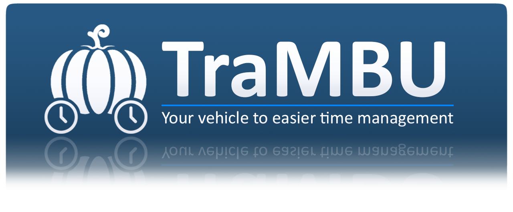

TRAMBU is an application aimed at making it easier for you to keep track of all the things you need to do.
This is done by providing an easy-to-use interface on top of regular text files on your computer that
hold your todo's. 

|Metrics||
|:---------|---------|
|| | 
 

# Features

To make your life as a busy professional easier, TRAMBU features a **clean default display** of all the activities you need to perform.
You are able to customize your experience using the built-in **"Projects-and-Tagging" system**. Using this system,
you are able to create your own structure in your activities. TRAMBU's **filters** make it easy to select only those tasks
which are relevant to you at this time.

  <figure>
    
    <figcaption>Default skin</figcaption>
  </figure>
  
  <figure>
      
      <figcaption>Yellorange skin</figcaption>
    </figure>

# You are in control of your data
By keeping your data in local plain text files, you are in full control of your todo list. 

- Your data is not stored on a server (TRAMBU runs locally)
- You can share your todo-lists between different machines using whatever technology you like
- You can make manual edits to the file if you do not feel like firing up the application
- You can open the file and read the data without having to use TRAMBU (even though it will probablt be easier to work if you do)

# Get tracking!

Go to [[our releases page]](https://github.com/justDoji/TraMBU/releases){:target="_blank"}, and download the latest version.
Be sure you have the Java runtime environment installed on your computer.
Try this by running

> java -version

If the Java Runtime is installed, you should see ouput containing the version and installation location. 
If you get a 'command not found' message, head over to the [Oracle site](https://www.oracle.com/technetwork/java/javase/downloads/index.html) and download the Java Runtime Environment.
TRAMBU works best with the Java 8 runtime environment.

To run TRAMBU, navigate to the folder containing the downloaded *'.jar'* file, open a command prompt and execute:

> java -jar trambu-application.jar

You should see a bunch of lines being printed to your terminal.
When the output line *'Started TrambuWebApplication in XXX seconds'* is displayed,
TRAMBU will have started. You can access the application by navigating your favorite web browser to:

> http://localhost:8080/index.xhtml

# More information

## Bug Reports
In the event of a sneaky crawly making it's nest in our code, we welcome you to open a ticket on our [[Github issue tracker]](https://github.com/justDoji/TraMBU/issues){:target="_blank"}

## Contributing
Thank you for considering contributing to TraMBU. We really appreciate your interest in our project,  
and would love to welcome you as a contributor.  

We are always looking for your input!  
Take a look at our [[Contribution Guide]](CONTRIBUTING.md){:target="_blank"}!

## License

TraMBU is licened under the AGPL license. Basically: You are free to use, fork, and modify the code.
However, the original author must be accredited. Any code changes must be made public under  
the the same license.

## Project origin

If you are interested in how this project came to be, take a look at the  [[About page]](./docs/ABOUT.md)